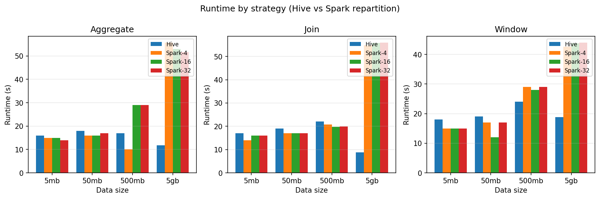

# Capstone Report: Workload-Aware Partitioning Advisor

**Author:** Weikeng Yang
**Date:** 3/1/2026

---

## 1. Abstract

This project implements a **lightweight, workload-aware Partitioning Advisor** for Apache Spark with Hive: given **data size** (5mb / 50mb / 500mb / 2gb) and **query type** (aggregate / join / window), it recommends a partitioning strategy (Hive partitioning or Spark repartition) and, for repartition, the number of partitions (4 / 16 / 32), with an optional optimization objective (runtime / CPU / memory). The Advisor is built on an experiment summary table (lookup-based, V1). On all 12 (data_size, query_type) combinations in that summary, its recommendations match the empirically best configuration for runtime with **100% agreement**. The experiments show that at larger scales (e.g., 2gb) Hive partitioning has a clear runtime advantage; join workloads are most sensitive to strategy choice; and a moderate partition count (e.g., 4) often outperforms higher counts. The project is fully reproducible and provides a Dockerized Spark–Hive cluster, experiment and data-collection scripts, the summary pipeline, the Advisor CLI, and evaluation scripts, with documentation for replication and extension.

---

## 2. Introduction and Goals

### 2.1 Context

- The work uses a Docker-deployed Hadoop + Hive + Spark cluster to compare **native Hive partitioning** with **explicit Spark repartition(4/16/32)** across multiple data sizes and three query types (aggregation, join, window), using runtime and resource usage (CPU/memory) as metrics.

### 2.2 Dataset and Environment

- **Dataset**: Experiments use a tabular dataset (trip-record style) at multiple scales: 5MB, 50MB, 500MB, and 2GB. Data is partitioned in Hive by selected columns and stored in HDFS; the same data is used with Spark repartition for comparison.
- **Environment**: A Docker-based cluster with one master node, two worker nodes, plus Hive metastore and Spark History Server. YARN manages resource allocation; HDFS holds the data. Jobs are submitted from the master via `spark-submit --master yarn`.

### 2.3 Capstone Goal

- **Goal**: Deliver a **Partitioning Advisor** that, given workload (data size + query type), automatically suggests a partitioning strategy and configuration to reduce manual tuning.

---

## 3. Method: Advisor Design

- **Input**: `data_size` (5mb / 50mb / 500mb / 2gb), `query_type` (aggregate / join / window), `objective` (runtime / cpu / memory; default runtime).
- **Output**: Recommended `strategy` (hive or spark_repartition), `num_partitions` (4/16/32 when repartition), `reason`, and the corresponding summary row.
- **Logic**: From `experiment_summary.csv`, filter by (data_size, query_type), choose the best row by `objective` (minimum runtime / min max_cpu / min max_memory), and return that row’s strategy and configuration.

---

## 4. Implementation

**Data flow**: Runtime records (`*_results.csv`) and per-task resource samples (`*_stats/*.csv`) under `stats_collection_tools/` are merged by `advisor/scripts/build_summary.py` into a single `advisor/experiment_summary.csv`. The Advisor reads this summary and, for a given (data_size, query_type) and objective, returns the best row’s strategy and partition count. The flow is: **raw results + stats → build_summary → experiment_summary.csv → recommend() / CLI**.

- **Data pipeline**: `*_results.csv` (runtime) and `*_stats/*.csv` (CPU/memory) under `stats_collection_tools/` → `advisor/scripts/build_summary.py` → `advisor/experiment_summary.csv`.
- **Recommendation and CLI**: `advisor/recommend.py` exposes `recommend()`; `advisor/advisor.py` provides the CLI. Example run:

```text
$ python3 advisor/advisor.py --data-size 50mb --query-type join
Recommendation:
  strategy:        spark_repartition
  num_partitions:  4
  reason:          Lowest runtime (17.0s) for 50mb join in experiments: use Spark repartition(4).
```

- **Evaluation and visualization**: `advisor/scripts/evaluate_advisor.py` compares recommendations to the true best; `advisor/scripts/plot_runtime.py` produces the runtime comparison figure.

---

## 5. Experiments and Data

- **Summary table**: `advisor/experiment_summary.csv`, with columns data_size, query_type, strategy, num_partitions, runtime_seconds, max_cpu_pct, max_memory_mib, covering 5mb / 50mb / 500mb / 2gb × aggregate / join / window × hive and spark_repartition(4/16/32).
- **Data source and limitations**: Parts of 500mb runtime (e.g. join 4/16/32) use values from the same source for comparability; the rest and 5mb/50mb runtimes come from project runs.

### 5.1 Runtime Comparison (Hive vs Spark repartition)

The figure below is generated by `advisor/scripts/plot_runtime.py` from `experiment_summary.csv`. It shows runtime (seconds) for Hive and Spark repartition(4/16/32) across data sizes (5mb, 50mb, 500mb, 2gb) for each query type (Aggregate, Join, Window).



_Figure 1: Runtime by strategy (Hive vs Spark repartition). Left: Aggregate; center: Join; right: Window._

### 5.2 Experiment Summary Data (runtime, seconds)

The tables below give **runtime_seconds** from the summary table, matching the figure.

**Aggregate**

| Data size | Hive  | Spark-4 | Spark-16 | Spark-32 |
| --------- | ----- | ------- | -------- | -------- |
| 5mb       | 16.0  | 15.0    | 15.0     | 14.0     |
| 50mb      | 18.0  | 16.0    | 16.0     | 17.0     |
| 500mb     | 17.0  | 10.0    | 29.0     | 29.0     |
| 5gb       | 11.72 | 55.63   | 52.89    | 51.64    |

**Join**

| Data size | Hive | Spark-4 | Spark-16 | Spark-32 |
| --------- | ---- | ------- | -------- | -------- |
| 5mb       | 17.0 | 14.0    | 16.0     | 16.0     |
| 50mb      | 19.0 | 17.0    | 17.0     | 17.0     |
| 500mb     | 22.0 | 20.84   | 19.72    | 19.89    |
| 5gb       | 8.84 | 54.82   | 55.76    | 55.89    |

**Window**

| Data size | Hive  | Spark-4 | Spark-16 | Spark-32 |
| --------- | ----- | ------- | -------- | -------- |
| 5mb       | 18.0  | 15.0    | 15.0     | 15.0     |
| 50mb      | 19.0  | 17.0    | 12.0     | 17.0     |
| 500mb     | 24.0  | 29.0    | 28.0     | 29.0     |
| 5gb       | 18.87 | 42.63   | 43.81    | 43.94    |

Full fields (including **max_cpu_pct** and **max_memory_mib**) are in `advisor/experiment_summary.csv`; when the user sets `--objective cpu` or `--objective memory`, the Advisor selects the best row by minimum CPU or minimum memory instead of runtime.

---

## 6. Evaluation Results

With objective=runtime, the Advisor is evaluated on each (data_size, query_type) in the summary by comparing its recommendation to the true best row (same strategy and num_partitions counts as agreement). Running `python3 advisor/scripts/evaluate_advisor.py` yields **agreement rate 12/12 = 100.0%**. The table below shows, for each combination, the Advisor’s recommendation and the true best configuration; they match in every row.

| data_size | query_type | Advisor recommendation | True best              | Match |
| --------- | ---------- | ---------------------- | ---------------------- | ----- |
| 500mb     | aggregate  | spark_repartition n=4  | spark_repartition n=4  | Yes   |
| 500mb     | join       | spark_repartition n=16 | spark_repartition n=16 | Yes   |
| 500mb     | window     | hive                   | hive                   | Yes   |
| 50mb      | aggregate  | spark_repartition n=4  | spark_repartition n=4  | Yes   |
| 50mb      | join       | spark_repartition n=4  | spark_repartition n=4  | Yes   |
| 50mb      | window     | spark_repartition n=16 | spark_repartition n=16 | Yes   |
| 5gb       | aggregate  | hive                   | hive                   | Yes   |
| 5gb       | join       | hive                   | hive                   | Yes   |
| 5gb       | window     | hive                   | hive                   | Yes   |
| 5mb       | aggregate  | spark_repartition n=32 | spark_repartition n=32 | Yes   |
| 5mb       | join       | spark_repartition n=4  | spark_repartition n=4  | Yes   |
| 5mb       | window     | spark_repartition n=4  | spark_repartition n=4  | Yes   |

**Agreement rate: 12/12 = 100.0%**

---

## 7. Patterns and Discussion

From the experiment summary:

- **Scale**: At 5mb/50mb, Hive and repartition runtimes are similar; at 500mb the best choice depends on query type; at 2gb **Hive is strongly preferred** (roughly 4–5× runtime advantage over repartition).
- **Query type**: **Join** is most sensitive to strategy; for Aggregate/Window, repartition(4) is often a sweet spot at medium scale.
- **Partition count**: Higher counts (16/32) do not always help; 4 is often best, and 16/32 tend to use more resources with limited gain at large scale.

The Advisor’s behavior is consistent with these patterns; recommendations are driven by the summary table.

---

## 8. Conclusions and Future Work

- **Conclusions**: This capstone delivers a lookup-based Partitioning Advisor that, given data size and query type, recommends Hive or Spark repartition and partition count, achieving 100% agreement with the true best on the current experiment set. The project includes documentation and scripts for reproduction and extension.
- **Future work**:
  (1) Train a simple model from experiment_summary (e.g. (data_size, query_type) → strategy/num_partitions) and compare to the lookup;
  (2) add more data sizes, query features, or configuration dimensions;
  (3) skew-aware tuning or validation on more cluster environments.
