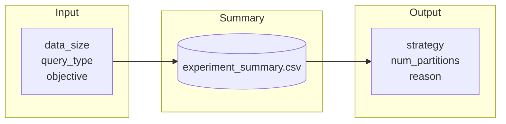
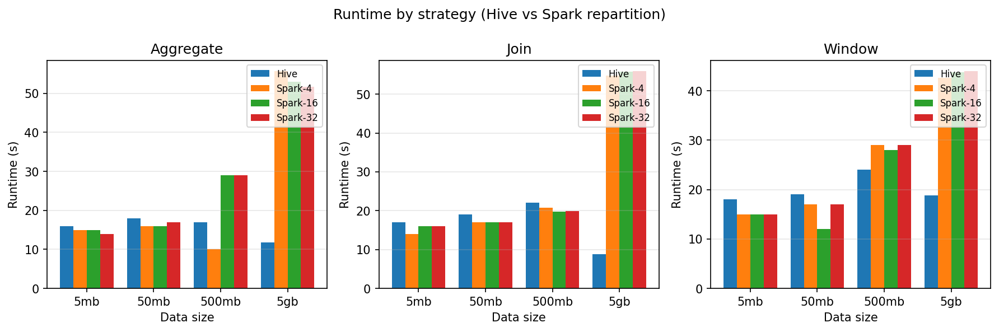

# Capstone Report: Workload-Aware Partitioning Advisor

**Author:** Weikeng Yang

**Submit Date:**

---

## 1. Abstract

Choosing partition strategy and count for Spark–Hive workloads is often done by trial-and-error. This project implements a **lightweight, workload-aware Partitioning Advisor** for Apache Spark with Hive: given **data size** (5mb / 50mb / 500mb / 2gb) and **query type** (aggregate / join / window), it recommends a partitioning strategy (Hive partitioning or Spark repartition) and, for repartition, the number of partitions (4 / 16 / 32), with an optional optimization objective (runtime / CPU / memory). The Advisor is built on an experiment summary table (lookup-based, V1). On all 12 (data_size, query_type) combinations in that summary, its recommendations match the empirically best configuration for runtime with **100% agreement**. The experiments show that at larger scales (e.g., 2gb) Hive partitioning has a clear runtime advantage; join workloads are most sensitive to strategy choice; and a moderate partition count (e.g., 4) often outperforms higher counts. The project is fully reproducible and provides a Dockerized Spark–Hive cluster, experiment and data-collection scripts, the summary pipeline, the Advisor CLI, and evaluation scripts, with documentation for replication and extension. The Advisor reduces manual tuning by providing a consistent, data-driven recommendation for partition strategy and count.

---

## 2. Introduction and Goals

### 2.1 Context

- The work uses a Docker-deployed Hadoop + Hive + Spark cluster to compare **native Hive partitioning** with **explicit Spark repartition(4/16/32)** across multiple data sizes and three query types (aggregation, join, window), using runtime and resource usage (CPU/memory) as metrics.

### 2.2 Dataset and Environment

- **Dataset**: Experiments use a tabular dataset (trip-record style) at multiple scales: 5MB, 50MB, 500MB, and 2GB. Data is partitioned in Hive by selected columns and stored in HDFS; the same data is used with Spark repartition for comparison.
- **Environment**: A Docker-based cluster with one master node, two worker nodes, plus Hive metastore and Spark History Server. YARN manages resource allocation; HDFS holds the data. Jobs are submitted from the master via `spark-submit --master yarn`.

### 2.3 Problem and Goal

- **Problem**: Choosing between Hive partitioning and Spark repartitioning, and the partition count (e.g., 4, 16, 32), for different data sizes and query types is typically done by manual trial-and-error, which is time-consuming and hard to standardize across pipelines or teams.
- **Goal**: Deliver a **Partitioning Advisor** that, given workload (data size + query type), automatically suggests a partitioning strategy and configuration, reducing manual tuning and providing a consistent, reproducible recommendation that can be wired into pipelines or used as decision support.

---

## 3. Method: Advisor Design

### 3.1 Design Approach

The core idea is **empirical lookup**: first run a controlled set of experiments (all combinations of data size, query type, and partitioning strategy), record runtime and resource metrics, and build a summary table of the best configuration per (data_size, query_type) and per objective; then, at recommendation time, the Advisor simply looks up that table for the user’s (data_size, query_type) and objective and returns the corresponding strategy and partition count. There is no SQL parsing or cost model—the “model” is the experiment summary itself. This keeps the system simple, interpretable, and directly grounded in measured data.

The design has two phases:

1. **Experiment phase**: Run Spark–Hive jobs for each (data_size, query_type, strategy, num_partitions); collect runtimes and optional CPU/memory; aggregate into one row per (data_size, query_type, strategy, num_partitions) with minimum runtime and max CPU/memory; then, for each (data_size, query_type), identify the best row per objective (e.g. minimum runtime) and store the result in a summary table.
2. **Recommendation phase**: Given user input (data_size, query_type, objective), filter the summary to that (data_size, query_type), select the best row by the chosen objective, and return that row’s strategy and num_partitions (and reason).

The following diagram illustrates the overall flow from workload input to recommendation output, and how the summary table is produced from raw experiment data.


```mermaid
flowchart LR
  subgraph Input
    A[data_size\nquery_type\nobjective]
  end
  subgraph Summary
    T[(experiment_summary.csv)]
  end
  subgraph Output
    R[strategy\nnum_partitions\nreason]
  end
  A --> T
  T --> R
```

_Figure: Recommendation flow: user input → lookup in experiment summary → recommended strategy and partition count._

The next diagram shows how the summary table is built from experiments (one-time / batch) and then used when serving a recommendation (each time the user runs the Advisor).

```mermaid
flowchart TB
  subgraph Batch["Batch: build summary (one-time or when new data is added)"]
    E[Run experiments\n(data_size × query_type × strategy × num_partitions)]
    E --> C[Collect runtime & resource metrics]
    C --> B[build_summary.py]
    B --> S[(experiment_summary.csv)]
  end
  subgraph AtRecommendation["At recommendation time (each Advisor run)"]
    I[User: data_size, query_type, objective]
    I --> L[Filter summary by data_size, query_type]
    L --> P[Pick best row by objective]
    P --> O[Return strategy, num_partitions, reason]
  end
  S --> L
```

_Figure: Batch phase (experiments → summary table) and recommendation-time phase (user input → lookup → recommendation). The project implements both: experiments and build_summary produce the table; the CLI and recommend() use it to answer each request._

### 3.2 Input, Output, and Lookup Logic

- **Input**: `data_size` (5mb / 50mb / 500mb / 2gb), `query_type` (aggregate / join / window), `objective` (runtime / cpu / memory; default runtime).
- **Output**: Recommended `strategy` (hive or spark_repartition), `num_partitions` (4/16/32 when repartition), `reason`, and the corresponding summary row.
- **Logic**: From `experiment_summary.csv`, filter by (data_size, query_type), choose the best row by `objective` (minimum runtime / min max_cpu / min max_memory), and return that row’s strategy and configuration.

---

## 4. Implementation

**Data flow**: Runtime records (`*_results.csv`) and per-task resource samples (`*_stats/*.csv`) under `stats_collection_tools/` are merged by `advisor/scripts/build_summary.py` into a single `advisor/experiment_summary.csv`. The Advisor reads this summary and, for a given (data_size, query_type) and objective, returns the best row’s strategy and partition count. The flow is: **raw results + stats → build_summary → experiment_summary.csv → recommend() / CLI**.

- **Data pipeline**: `*_results.csv` (runtime) and `*_stats/*.csv` (CPU/memory) under `stats_collection_tools/` → `advisor/scripts/build_summary.py` → `advisor/experiment_summary.csv`.
- **Recommendation and CLI**: `advisor/recommend.py` exposes `recommend()`; `advisor/advisor.py` provides the CLI. Example run:

```text
$ python3 advisor/advisor.py --data-size 50mb --query-type join
Recommendation:
  strategy:        spark_repartition
  num_partitions:  4
  reason:          Lowest runtime (17.0s) for 50mb join in experiments: use Spark repartition(4).
```

- **Evaluation and visualization**: `advisor/scripts/evaluate_advisor.py` compares recommendations to the true best; `advisor/scripts/plot_runtime.py` produces the runtime comparison figure.

---

## 5. Experiments and Data

### 5.0 Research Question, Hypothesis, and Methodology

- **Research question**: (1) Does the choice of partitioning strategy (Hive vs Spark repartition) and partition count (4, 16, 32) significantly affect runtime and resource usage for different data sizes and query types? (2) Can a lightweight Advisor that uses a lookup over an experiment summary correctly recommend the best configuration for each (data_size, query_type)?

- **Hypothesis**: Runtime and resource usage depend on data size, query type, and (strategy, num_partitions); for each (data_size, query_type) there exists a best configuration in our experiment grid; and a rule-based lookup over a summary of that grid can replicate that best choice and thus serve as a usable Advisor.

- **Why this methodology**: To answer whether strategy and partition count matter, we need **controlled experiments** that vary only those factors while keeping data, query logic, and cluster fixed. So we run all combinations of data size (5mb, 50mb, 500mb, 2gb), query type (aggregate, join, window), and configuration (Hive, Spark-4, Spark-16, Spark-32), measure runtime (and optionally CPU/memory), and record the best per (data_size, query_type) and per objective. This gives us a ground-truth table. To turn it into an Advisor, we use **lookup**: for any user (data_size, query_type, objective), we return the row that minimizes the chosen metric. This methodology is appropriate because (a) the research question is empirical—“which configuration is best?”—so we must measure, not only reason from first principles; (b) the Advisor’s job is to surface that best configuration, so a lookup over the measured summary is a direct and interpretable design; (c) the same summary supports evaluation (compare Advisor output to true best) and visualization (e.g. runtime comparison plots).

---

### 5.1 Summary Table and Data Source

- **Summary table**: `advisor/experiment_summary.csv`, with columns data_size, query_type, strategy, num_partitions, runtime_seconds, max_cpu_pct, max_memory_mib, covering 5mb / 50mb / 500mb / 2gb × aggregate / join / window × hive and spark_repartition(4/16/32).
- **Data source and limitations**: Parts of 500mb runtime (e.g. join 4/16/32) use values from the same source for comparability; the rest and 5mb/50mb runtimes come from project runs.

### 5.2 Runtime Comparison (Hive vs Spark repartition)

The figure below is generated by `advisor/scripts/plot_runtime.py` from `experiment_summary.csv`. It shows runtime (seconds) for Hive and Spark repartition(4/16/32) across data sizes (5mb, 50mb, 500mb, 2gb) for each query type (Aggregate, Join, Window).



_Figure 1: Runtime by strategy (Hive vs Spark repartition). Left: Aggregate; center: Join; right: Window._

### 5.3 Experiment Summary Data (runtime, seconds)

The tables below give **runtime_seconds** from the summary table, matching the figure.

**Aggregate**

| Data size | Hive  | Spark-4 | Spark-16 | Spark-32 |
| --------- | ----- | ------- | -------- | -------- |
| 5mb       | 16.0  | 15.0    | 15.0     | 14.0     |
| 50mb      | 18.0  | 16.0    | 16.0     | 17.0     |
| 500mb     | 17.0  | 10.0    | 29.0     | 29.0     |
| 5gb       | 11.72 | 55.63   | 52.89    | 51.64    |

**Join**

| Data size | Hive | Spark-4 | Spark-16 | Spark-32 |
| --------- | ---- | ------- | -------- | -------- |
| 5mb       | 17.0 | 14.0    | 16.0     | 16.0     |
| 50mb      | 19.0 | 17.0    | 17.0     | 17.0     |
| 500mb     | 22.0 | 20.84   | 19.72    | 19.89    |
| 5gb       | 8.84 | 54.82   | 55.76    | 55.89    |

**Window**

| Data size | Hive  | Spark-4 | Spark-16 | Spark-32 |
| --------- | ----- | ------- | -------- | -------- |
| 5mb       | 18.0  | 15.0    | 15.0     | 15.0     |
| 50mb      | 19.0  | 17.0    | 12.0     | 17.0     |
| 500mb     | 24.0  | 29.0    | 28.0     | 29.0     |
| 5gb       | 18.87 | 42.63   | 43.81    | 43.94    |

Full fields (including **max_cpu_pct** and **max_memory_mib**) are in `advisor/experiment_summary.csv`; when the user sets `--objective cpu` or `--objective memory`, the Advisor selects the best row by minimum CPU or minimum memory instead of runtime.

---

## 6. Evaluation Results

With objective=runtime, the Advisor is evaluated on each (data_size, query_type) in the summary by comparing its recommendation to the true best row (same strategy and num_partitions counts as agreement). Running `python3 advisor/scripts/evaluate_advisor.py` yields **agreement rate 12/12 = 100.0%**. The table below shows, for each combination, the Advisor’s recommendation and the true best configuration; they match in every row.

| data_size | query_type | Advisor recommendation | True best              | Match |
| --------- | ---------- | ---------------------- | ---------------------- | ----- |
| 500mb     | aggregate  | spark_repartition n=4  | spark_repartition n=4  | Yes   |
| 500mb     | join       | spark_repartition n=16 | spark_repartition n=16 | Yes   |
| 500mb     | window     | hive                   | hive                   | Yes   |
| 50mb      | aggregate  | spark_repartition n=4  | spark_repartition n=4  | Yes   |
| 50mb      | join       | spark_repartition n=4  | spark_repartition n=4  | Yes   |
| 50mb      | window     | spark_repartition n=16 | spark_repartition n=16 | Yes   |
| 5gb       | aggregate  | hive                   | hive                   | Yes   |
| 5gb       | join       | hive                   | hive                   | Yes   |
| 5gb       | window     | hive                   | hive                   | Yes   |
| 5mb       | aggregate  | spark_repartition n=32 | spark_repartition n=32 | Yes   |
| 5mb       | join       | spark_repartition n=4  | spark_repartition n=4  | Yes   |
| 5mb       | window     | spark_repartition n=4  | spark_repartition n=4  | Yes   |

**Agreement rate: 12/12 = 100.0%**

---

## 7. Patterns and Discussion

From the experiment summary:

- **Scale**: At 5mb/50mb, Hive and repartition runtimes are similar; at 500mb the best choice depends on query type; at 2gb **Hive is strongly preferred** (roughly 4–5× runtime advantage over repartition).
- **Query type**: **Join** is most sensitive to strategy; for Aggregate/Window, repartition(4) is often a sweet spot at medium scale.
- **Partition count**: Higher counts (16/32) do not always help; 4 is often best, and 16/32 tend to use more resources with limited gain at large scale.

The Advisor’s behavior is consistent with these patterns; recommendations are driven by the summary table.

---

## 8. Conclusions and Future Work

- **Conclusions**: This capstone delivers a lookup-based Partitioning Advisor that, given data size and query type, recommends Hive or Spark repartition and partition count, achieving 100% agreement with the true best on the current experiment set. The project includes documentation and scripts for reproduction and extension.
- **Future work**:
  (1) Train a simple model from experiment_summary (e.g. (data_size, query_type) → strategy/num_partitions) and compare to the lookup;
  (2) add more data sizes, query features, or configuration dimensions;
  (3) skew-aware tuning or validation on more cluster environments.
